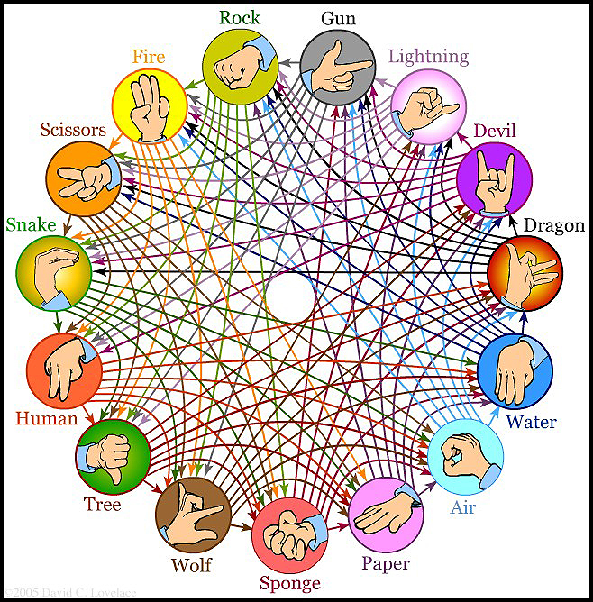

# Rock-Paper-Scissors  
   ## Game rules 
# 

## Objectives

### Program does:

1. Output a line `Enter your name:` . Note that the user should enter his/her name on the same line (not the one following the output!)
2. Read input specifying the user's name and output a new line `Hello, <name>`
3. Read a file named `rating.txt` and check if there's a record for the user with the same name; if yes, use the score specified in the `rating.txt` for this user as a starting point for calculating the score in the current game. If no, start counting user's score from 0.
4. Read input specifying the list of options that will be used for playing the game (options are separated by comma). If the input is an empty line, play with default options.
5. Output a line `Okay, let's start`
6. Play the game by the rules defined on the previous stages:
7. Read user's input
8. If the input is `!exit`, output Bye! and stop the game
9. If the input is the name of the option, then:
10. Pick a random option
11. Output a line with the result of the game in the following format (<option> is the name of the option chosen by the program):
       - `Lose -> Sorry, but the computer chose <option>`
       -  `Draw -> There is a draw (<option>)`
       - `Win -> Well done. The computer chose <option> and failed`
12. For each draw, add 50 points to the score. For each user's win, add 100 to his/her score. In case the user loses, don't change the score.
13. If the input corresponds to anything else, output Invalid input
14. Play the game again (with the same options that were defined before the start of the game)

#### To play game follow the link  -->  and click green button "Run" 
